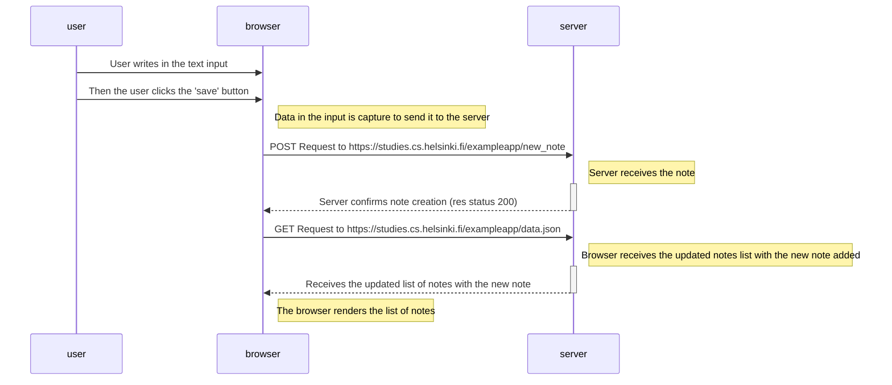

```mermaid
sequenceDiagram
    participant user
    participant browser
    participant server

    user ->>browser: User writes in the text input
    user ->>browser: Then the user clicks the 'save' button
    Note right of browser: Data in the input is capture to send it to the server

    browser ->>server: POST Request to https://studies.cs.helsinki.fi/exampleapp/new_note

    Note right of server: Server receives the note
    activate server

    server-->>browser: Server confirms note creation (res status 200)
    deactivate server

    browser->>server: GET Request to https://studies.cs.helsinki.fi/exampleapp/data.json

    Note right of server: Browser receives the updated notes list with the new note added
    activate server
    
    server-->>browser: Receives the updated list of notes with the new note
    deactivate server
    
    Note right of browser: The browser renders the list of notes
```