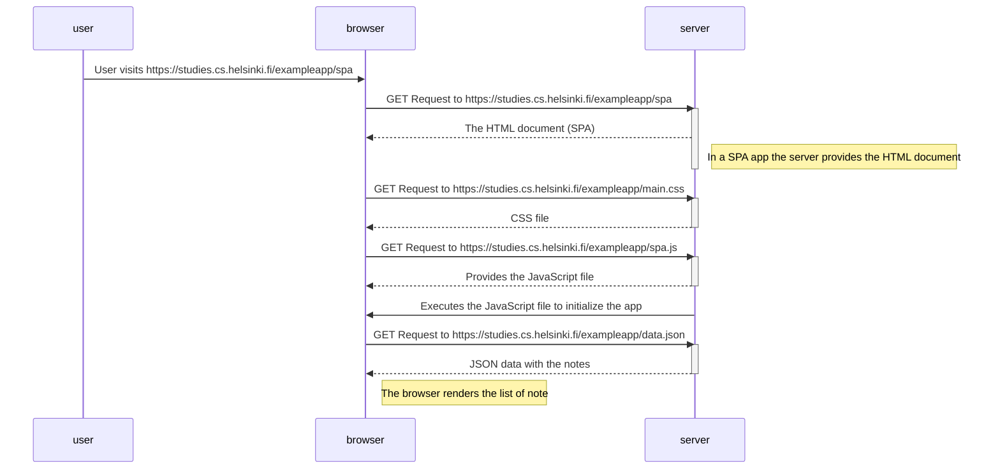

```mermaid
sequenceDiagram
    participant user
    participant browser
    participant server

    user ->>browser: User visits https://studies.cs.helsinki.fi/exampleapp/spa
    browser->>server: GET Request to https://studies.cs.helsinki.fi/exampleapp/spa
    activate server
    server-->>browser: The HTML document (SPA)

    Note right of server: In a SPA app the server provides the HTML document 

    deactivate server

    browser->>server: GET Request to https://studies.cs.helsinki.fi/exampleapp/main.css
    activate server
    server-->>browser: CSS file
    deactivate server

    browser->>server: GET Request to https://studies.cs.helsinki.fi/exampleapp/spa.js
    activate server
    server-->>browser: Provides the JavaScript file
    deactivate server

    server->>browser: Executes the JavaScript file to initialize the app
    browser->>server: GET Request to https://studies.cs.helsinki.fi/exampleapp/data.json
    activate server
    server-->>browser: JSON data with the notes
    deactivate server

    Note right of browser: The browser renders the list of note
```