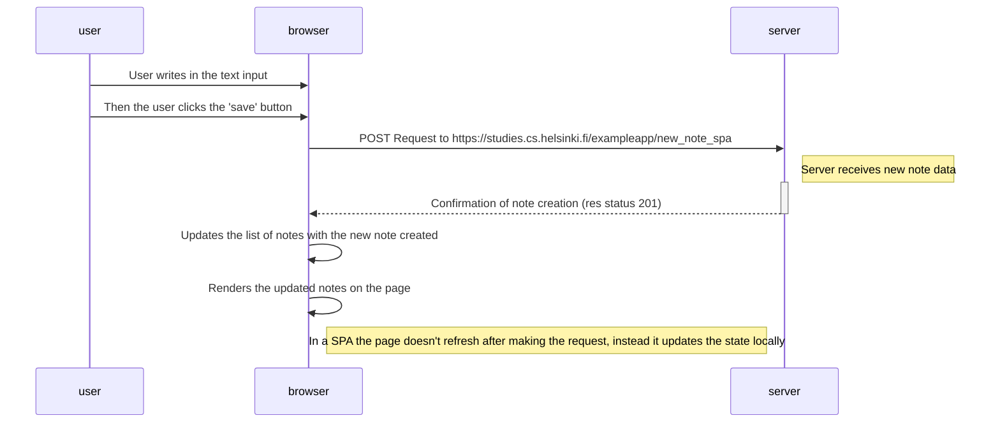

```mermaid
sequenceDiagram
    participant user
    participant browser
    participant server

    user ->>browser: User writes in the text input
    user ->>browser: Then the user clicks the 'save' button
    
    browser ->>server: POST Request to https://studies.cs.helsinki.fi/exampleapp/new_note_spa
    Note right of server: Server receives new note data
    activate server
    server-->>browser: Confirmation of note creation (res status 201)
    deactivate server

    browser->>browser: Updates the list of notes with the new note created
    browser->>browser: Renders the updated notes on the page

    Note right of browser: In a SPA the page doesn't refresh after making the request, instead it updates the state locally
```